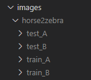

# Agro Cycle Gan

Platform to create syntetic image datasets using CycleGAN. It transforms images from a domain A with some features to a domain B with different features (for example horses to horses, day to night, etc). It uses CycleGAN, which allows to use unsupervised learning to transform images between two domains. 

In order to do so, it is possible to add the the image dataset to the *images* folder as follows:  



Where *train_A* contains the images to train from the domain A and *train_B* contains images to train from the domain B. The same happens for the testing. 

### Train
To train the models use:

```bash
python -u train.py horse2zebra --batch_size 10 --num_epochs 20 --image_resize 64 64
```

Where `horse2zebra` is the name of the folder with the training images.

### Generate

In order to generate images run:

```bash
python generate.py ./images/horse2zebra/test_A/A ./images_gen/horse2zebra/ --generator_name horse2zebra --dest_domain B
```

Where `./images/horse2zebra/test_A/A` is the folder containing the images to transform, `./images_gen/horse2zebra/` is the destination folder where the transformed images will be stored. The generator name must be equal to the dataset name. It is possible to select the desination domain with `--dest_domain` (it can be A or B). 

### Documentation 

* https://agro-cycle-gan.readthedocs.io/en/latest/ (WIP)